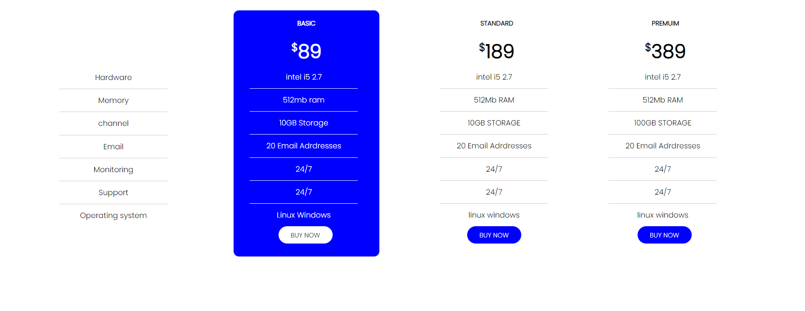
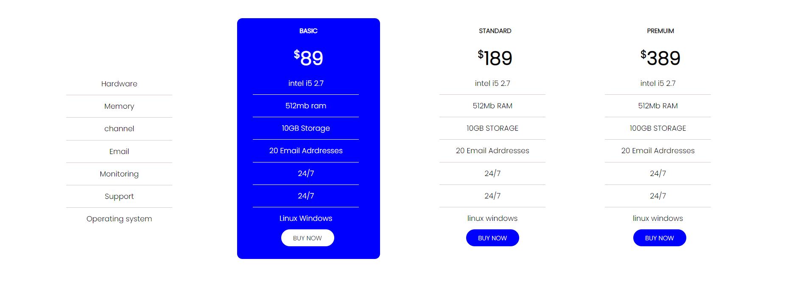
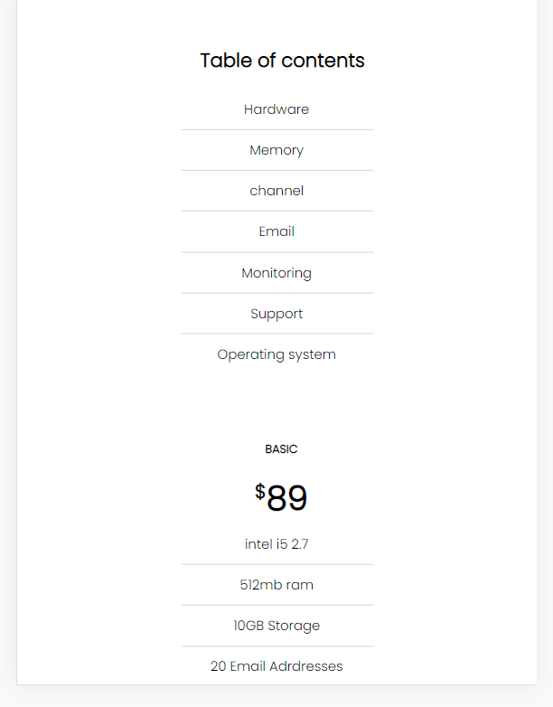
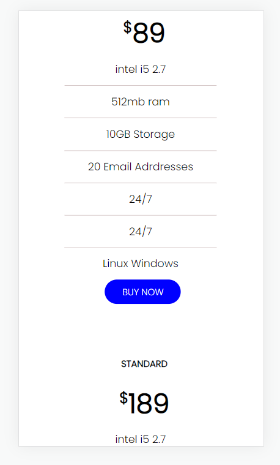
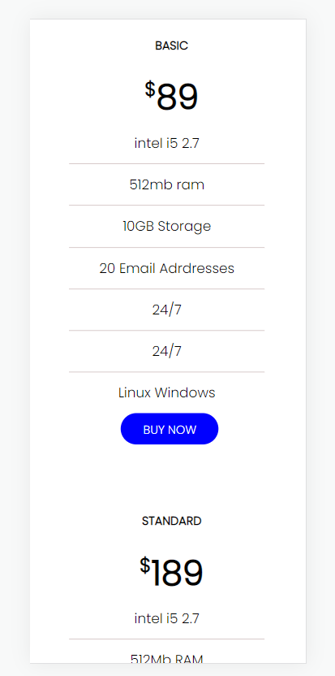

 ## Creating a Basic business card.

 # Welcome!

 Thankyou for checking this work. 

 ##ABOUT THIS WORK:
    This a work done for practising of CSS(Cascading Style Sheet), making sure i get to work on designing of price panel cards, because cards are important aspect in our sites.We find them almost everywhere. This is an intro to cards and flex-box designs.

 ## pictures, of our work;
 
            
   ##process##           
            THIS FILE IS FOR PRACTISE OF BASIC HTML
            
         OVERVIEW(/.html/)
         - PRACTISE MAKING OF A VERY NEAT AND EASY TO UNDERSTAND HTML(mark-up language) SCRIPT FOR EASY UNDERSTANDING.
         - PRACTISE HOW TO USE THE COL
         - THE USE OF LINK TAGS
         - PRACTISE SEMANTIC ELEMENTS, BLOCK-LEVEL ELEMENTS(DIVS), ADEQUATE LAYOUT.
     

         
          OVERVIEW(/.css/)
         - PRACTISE DESIGNING OF LAYOUT'S INFORM OF CARD'S TO MAKE THEM ARRANGED EQUALLY
         - PRACTISE HOW TO USE THE FLEX-BOX TERMINLOGIES SUCH AS COLUMN, ROW ETC TO PROVIDE THE BEST RESULT.
         - THE STYLING OF BUTTONS AND BRINGING OUT COLORFUL HOVER EFFECTS
         - PRACTISE ON HOW TO USE SPACING UTILITIES PROPERLY.  

## checkout our differrent screen sizes         
##large size

     

  

##smaler size

  

   ## Built with         
      -HTML(Hypertext Mark-up Language)
      -CSS(Cascading Styles Sheet)

   ## My Challanges and lessons
   Learnt how to re-size card with percentages firstly, used my fontsizes well, my bioler plate helped too, just for strict positioning of important values  and also  it was so intersting.
            
   ## Installations
   -For those Farmiliar with Git-hub you can clone the repo and pull to your local workplace to view.
   -For those who want to view you can download the file from here [https://jmp.sh/j0pU2gl], to view Thank you once again.
            

   ## Resources that helped ##
   -For the Colors[https://coolors.co/palettes/trending/blue]
   -For the Uploading of work[https://jumpshare.com/]
   
   ## Best syntax Used
   ``HTML
   (

 tags) and the (<h1></h1> tags).
   ``the container and the headers.
   

    ``CSS
 (Flex-box terminologies)
Both Justify and allign items were super useful in achieving a responsive card layout design.
   ``
   
   ## Licsense 
   This work is under [MIT] liscence. It's highly free and opensource to anyone.
   Thank you once again.
